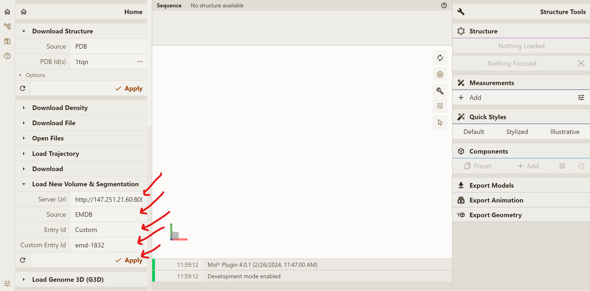
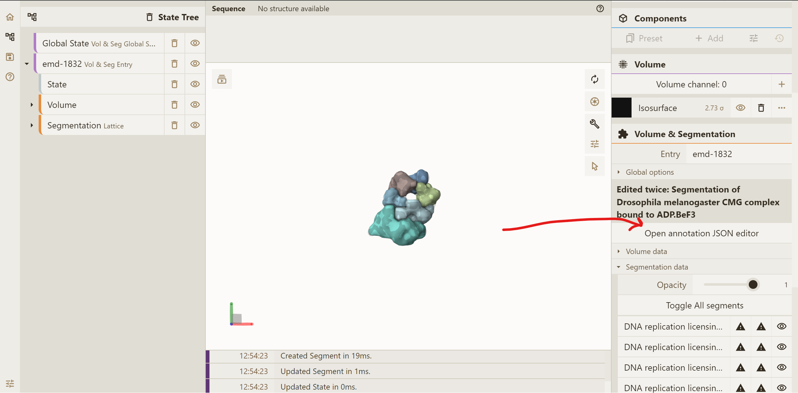
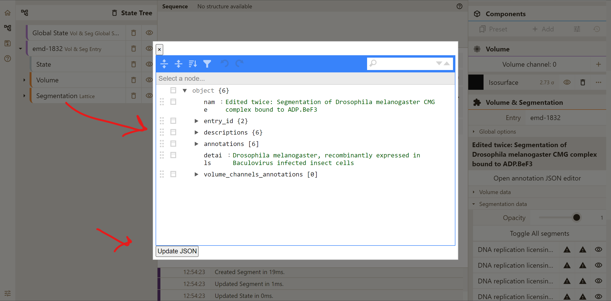

# Prerequistes
NPM and Node.js:
    https://docs.npmjs.com/downloading-and-installing-node-js-and-npm

# Installation
1. Clone repository:

	```
    git clone https://github.com/aliaksei-chareshneu/molstar-new
    ```
2. Change directory to `molstar-new`:
    ```
    cd molstar-new
    ```
3. Switch to `cvsx-new-query-app` branch:
    ```
    git checkout cvsx-new-query-app
    ```
4. Build:
    ```
    npm install
    npm run build
    npm run watch-viewer
    ```

# Running frontent locally
1. Run the following command:
```
npm run serve
```
2. In your browser, open:

http://127.0.0.1:1338/build/viewer/

# Using annotator app
1. In the UI, set the following fields:
 - Server url - `SERVER_URL`
 - Source - `EMDB`
 - Entry Id - `Custom`
 - Custom Entry Id - `emd-1832`

2. Press `Apply`
3. In the right panel, press `Annotation JSON editor`:

4. Edit any fields, update JSON when done:

