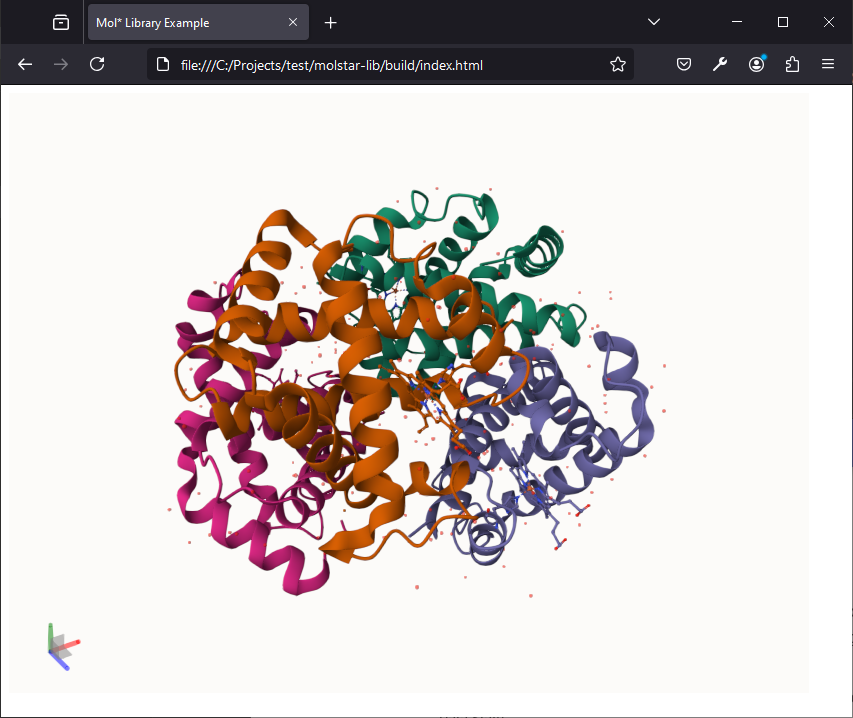
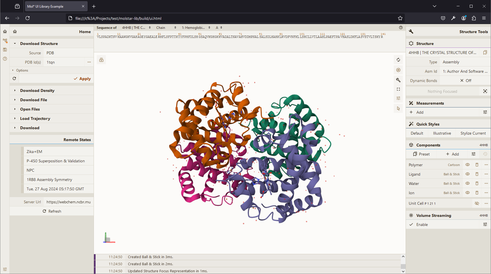

# Building a Custom Library

This page goes over creating a custom Mol\* based library usable inside a `<script>` tag in an HTML page.

## Setup

- Create a new npm/yarn package
- Install `molstar` and `esbuild` packages

```
mkdir molstar-lib
cd molstar-lib
npm init
npm install molstar
npm install esbuild --save-dev
```

## Example Library Code

Create new file `src/index.ts` (or `.js` if you don't want to use TypeScript):

```ts
import { DefaultPluginSpec, PluginSpec } from 'molstar/lib/mol-plugin/spec';
import { PluginContext } from 'molstar/lib/mol-plugin/context';

export async function initViewer(element: string | HTMLDivElement, options?: { spec?: PluginSpec }) {
    const parent = typeof element === 'string' ? document.getElementById(element)! as HTMLDivElement : element;
    const canvas = document.createElement('canvas') as HTMLCanvasElement;
    parent.appendChild(canvas);

    const spec = options?.spec ?? DefaultPluginSpec();

    const plugin = new PluginContext(spec);
    await plugin.init();

    plugin.initViewer(canvas, parent);

    return plugin;
}

export async function loadStructure(
    plugin: PluginContext,
    url: string,
    options?: { format?: string, isBinary?: boolean }
) {
    const data = await plugin.builders.data.download(
        { url, isBinary: options?.isBinary }
    );
    const trajectory = await plugin.builders.structure.parseTrajectory(
        data,
        options?.format ?? 'mmcif' as any
    );
    const preset = await plugin.builders.structure.hierarchy.applyPreset(trajectory, 'default');
    return preset;
}
```

## Building the Library

Add new commands to the `scripts` section of the `package.json` file

```json
"scripts": {
  "build": "esbuild src/index.ts --bundle --outfile=./build/js/index.js --global-name=molstarLib",
  "watch": "esbuild src/index.ts --bundle --outfile=./build/js/index.js --global-name=molstarLib --watch"
}
```

and run the command `npm run build` (or `watch` for interactive development experience). This will create `build/js/index.js` file which can be imported with a `<script>` tag and the exported functions called view the `molstarLib` prefix (you can customize this parameter).

## Using the Library

Create file `build/index.html`:

```html
<!DOCTYPE html>
<html lang="en">
    <head>
        <meta charset="utf-8" />
        <meta name="viewport" content="width=device-width, user-scalable=no, minimum-scale=1.0, maximum-scale=1.0">
        <title>Mol* Library Example</title>
    </head>
    <style>
        #viewer {
            position: absolute;
            width: 800px;
            height: 600px;
        }
    </style>
    <script type="text/javascript" src="./js/index.js"></script>
    <body>
        <div id="viewer"></div>
        <script type="text/javascript">
            async function init() {1
                const plugin = await molstarLib.initViewer("viewer");
                await molstarLib.loadStructure(
                    plugin,
                    "https://models.rcsb.org/4hhb.bcif",
                    { isBinary: true }
                );
            }
            init();
        </script>
    </body>
</html>
```

After opening `index.html` in a browser, you should see 



## Using Mol* React UI

The above example does not make use of the default Mol\* React UI and any UI components are therefore the author's responsibility. The below examples show how to (re)use the Mol\* React UI.

- Create `src/ui.tsx`:
```tsx
import React from 'react';
import { createRoot } from 'react-dom/client';

import { DefaultPluginUISpec, PluginUISpec } from 'molstar/lib/mol-plugin-ui/spec';
import { PluginUIContext } from 'molstar/lib/mol-plugin-ui/context';
import { Plugin } from 'molstar/lib/mol-plugin-ui/plugin';

export async function initViewerUI(element: string | HTMLDivElement, options?: { spec?: PluginUISpec }) {
    const parent = typeof element === 'string' ? document.getElementById(element)! as HTMLDivElement : element;
    const spec = { ...DefaultPluginUISpec(), ...options?.spec };
    const plugin = new PluginUIContext(spec);
    await plugin.init();

    createRoot(parent).render(<Plugin plugin={plugin} />)

    return plugin;
}

export async function loadStructure(plugin: PluginUIContext, url: string, options?: { format?: string, isBinary?: boolean }) {
    const data = await plugin.builders.data.download({ url, isBinary: options?.isBinary });
    const trajectory = await plugin.builders.structure.parseTrajectory(data, options?.format ?? 'mmcif' as any);
    await plugin.builders.structure.hierarchy.applyPreset(trajectory, 'default');
}
```
- Create `src/style.scss`:
```scss
@use '../node_modules/molstar/lib/mol-plugin-ui/skin/light.scss';
```
- Create `build/ui.html`:
```html
<!DOCTYPE html>
<html lang="en">
    <head>
        <meta charset="utf-8" />
        <meta name="viewport" content="width=device-width, user-scalable=no, minimum-scale=1.0, maximum-scale=1.0">
        <title>Mol* UI Library Example</title>
    </head>
    <link rel="stylesheet" type="text/css" href="css/style.css" />
    <style>
        #viewer {
            position: absolute;
            inset: 0;
        }
    </style>
    <script type="text/javascript" src="./js/ui.js"></script>
    <body>
        <div id="viewer"></div>
        <script type="text/javascript">
            async function init() {
                const plugin = await molstarLib.initViewerUI("viewer", {
                    spec: {
                        layout: {
                            initial: {
                                isExpanded: true,
                                showControls: true,
                            },
                        },
                    }
                });
                await molstarLib.loadStructure(plugin, "https://models.rcsb.org/4hhb.bcif", { isBinary: true });
            }
            init();
        </script>
    </body>
</html>
```

- Install `sass`: `npm install sass -save-dev` (or use [`esbuild` plugin](https://www.npmjs.com/package/esbuild-sass-plugin) and `import` the scss file in `ui.tsx`)
- Add scripts to `package.json`:
```json
"build-ui": "esbuild src/ui.tsx --bundle --outfile=./build/js/ui.js --global-name=molstarLib",
"css": "sass src/style.scss ./build/css/style.css"
```
- Run `npm run build-ui` and `npm run css` (skip if using `esbuild-sass-plugin`)
- Opening `build/ui.html`:
