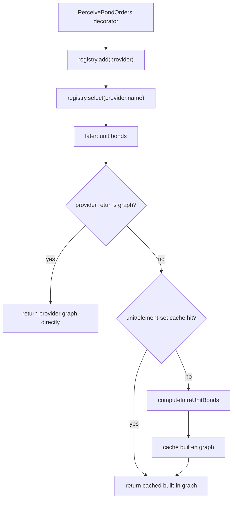

# Bond Orders extension: provider-registry POC

Each model gets a `BondProviderRegistry` lazily through
`BondProviderRegistry.get(model)`; `unit.bonds` first asks the explicitly selected provider
and falls through to Mol*'s implementation when the provider returns
`undefined`.

The public read path remains `unit.bonds`. A provider owns the full graph computation: it can
replace it, build a graph from scratch, or decline a unit so the built-in path handles it.

> `perceiveIntra` function in perveivers.ts is still a placeholder: eligible C–C bonds become double. Water and
> components covered by `IntraBondOrderTable` are left unchanged.
> The genuine bond perception implementation can replace it without changing the registry contract.

## Core API

`BondProviderRegistry.get(model)` stores and retrieves a model-scoped registry through the
model's dynamic property data, without adding a field to `Model` or changing model creation:

```ts
interface BondProvider {
    readonly name: string
    getBonds(unit: Unit.Atomic): IntraUnitBonds | undefined
}
```

Providers are registered by name with `add(provider)` and retrieved with `get(name)`, following
the same named-catalog pattern as other Mol* registries. Duplicate `add` calls are idempotent
and keep the first provider registered under a name. `select(name)` activates one provider;
selections are not stacked. Identity-checked `remove(provider)` restores default computation
only when removing the registered active instance.

Provider dispatch happens before `unit.props.bonds` and `ElementSetIntraBondCache`. A provided
graph bypasses both caches. Returning `undefined` leaves the complete built-in cache and
`computeIntraUnitBonds` path untouched. The registry therefore tracks no units and performs
no cache invalidation.

## Extension lifecycle

The `PerceiveBondOrders` Structure decorator does no bond computation. For a single-model
Structure it registers and selects one `BondOrderProvider`, then returns the same Structure
data. Disposal removes only that provider instance. Multi-model Structures are unsupported
and left on the built-in path.



The provider captures the decorated `Structure`, so the real perceiver can inspect inter-unit
neighbours lazily. It owns an element-set cache for its final graphs; removing the provider
releases that cache without touching core caches.

For supported non-`IndexPairBonds` models, the provider calls `findBonds` directly. While
perception computes `unit.rings`, a provider-owned `WeakMap` supplies that baseline graph to
the recursive `unit.bonds` access. This avoids recursion without changing Mol*'s ring code.
Perception uses only ring topology; aromatic ring/index getters remain lazy.

## Usage

Register the behavior and apply the extension preset:

```ts
import { BondOrders, BondOrdersTrajectoryPreset } from 'molstar/lib/extensions/bond-orders';

const spec = DefaultPluginUISpec();
spec.behaviors.push(PluginSpec.Behavior(BondOrders));

await plugin.builders.structure.hierarchy.applyPreset(
    trajectory,
    BondOrdersTrajectoryPreset
);
```

The preset accepts `bondOrdersMode`:

- `model`: modify only order-1 covalent edges marked `Computed`.
- `force`: allow the perceiver to replace all eligible intra-residue covalent orders.

## Format behavior

- PDB/mmCIF use their normal StructConn, ComponentBond, and distance graph. The provider
  overlays missing orders lazily.
- Order-less covalent `struct_conn`/CONECT entries are marked `Computed` in core so providers
  can distinguish unknown orders from explicit singles.
- SDF/mol/mol2 already expose file orders through `IndexPairBonds`; the demonstration
  `BondOrderProvider` returns `undefined`, preserving the built-in cached file graph.
- `getChild` units run through the same registry and therefore expose the same customization.
- Explicit trajectory ensembles and merged/docking Structures contain multiple models and
  deliberately fall back to built-in bonds. The normal default and “All Models” presets create
  separate single-model Structures and remain supported.
