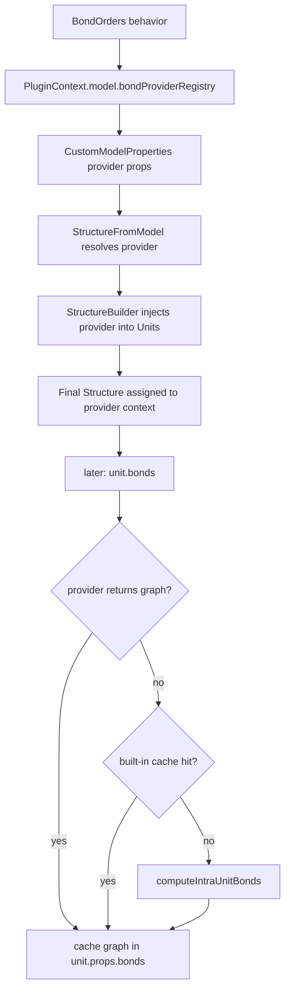

# Bond Orders extension: plugin-scoped provider POC

Available bond providers live in `PluginContext.model.bondProviderRegistry`. A dynamic
`CustomModelProperty` exposes the applicable providers and stores only the provider name and
parameters. Models contain no provider registry or active provider instance.

The public read path remains `unit.bonds`. Each atomic Unit receives one provider instance when
its Structure is built. The first `unit.bonds` access calls that provider and stores the result
in `unit.props.bonds`; subsequent accesses return the same graph. Returning `undefined` uses
the complete built-in `ElementSetIntraBondCache` and `computeIntraUnitBonds` path.

> `perceiveIntra` is still a placeholder: eligible C–C bonds become double. Water and
> components covered by `IntraBondOrderTable` are left unchanged.

## Provider lifecycle

The `BondOrders` plugin behavior adds the stateless bond-order provider to
`ctx.model.bondProviderRegistry` and registers the model-property bridge with
`ctx.customModelProperties`. `StructureFromModel` resolves the stored provider props against
the plugin registry and creates a fresh bond-provider instance for that Structure. The instance is
passed through `RootStructureDefinition` and `StructureBuilder` to every atomic Unit. Once the
final assembly or symmetry Structure has been built, its Structure context is assigned to the
provider, allowing the real perceiver to inspect `structure.interUnitBonds` without changing
the `getBonds(unit)` contract.


```mermaid
flowchart TD
  B["BondOrders behavior"] --> R["PluginContext.model.bondProviderRegistry"]
  R --> M["CustomModelProperties provider props"]
  M --> T["StructureFromModel resolves provider"]
  T --> S["StructureBuilder injects provider into Units"]
  S --> C["Final Structure assigned to provider context"]
  C --> L["later: unit.bonds"]
  L --> P{"provider returns graph?"}
  P -- yes --> O["cache graph in unit.props.bonds"]
  P -- no --> H{"built-in cache hit?"}
  H -- yes --> O
  H -- no --> D["computeIntraUnitBonds"]
  D --> O
```

For non-`IndexPairBonds` models, the provider calls `findBonds` directly to obtain the baseline
graph. While perception computes `unit.rings` or traverses intra-unit neighbors, a
provider-owned `WeakMap` supplies that baseline graph to recursive `unit.bonds` access. The
outer call then replaces the temporary baseline cache with the final perceived graph.

Changing the provider name or its parameters does not mutate existing Units. The new props
are applied the next time a Structure is created; automatic recreation of existing Structures
is intentionally left for future work.

## Usage

Register the behavior and apply the extension preset:

```ts
import { BondOrders, BondOrdersTrajectoryPreset } from 'molstar/lib/extensions/bond-orders';

const spec = DefaultPluginUISpec();
spec.behaviors.push(PluginSpec.Behavior(BondOrders));

await plugin.builders.structure.hierarchy.applyPreset(
    trajectory,
    BondOrdersTrajectoryPreset
);
```

The preset accepts `bondOrdersMode`:

- `none`: create Units without a custom provider and use Mol*'s built-in bond path.
- `auto`: modify only order-1 covalent edges marked `Computed`.
- `forceCompute`: allow the perceiver to replace all eligible intra-residue covalent orders.

## Format behavior

- PDB/mmCIF use their normal StructConn, ComponentBond, and distance graph. The provider
  overlays missing orders lazily.
- Order-less covalent `struct_conn`/CONECT entries are marked `Computed` in core so providers
  can distinguish unknown orders from explicit singles.
- SDF/mol/mol2 already expose file orders through `IndexPairBonds`; the demonstration
  `BondOrderProvider` returns `undefined`, preserving the built-in cached file graph.
- `getChild`, copied, and symmetry-operated Units retain the provider assigned by their root
  Structure.
