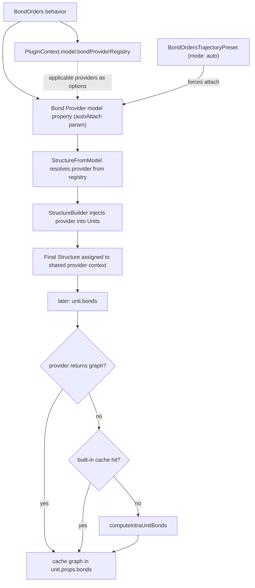

# Bond Orders extension: plugin-scoped provider POC

Available bond providers live in `PluginContext.model.bondProviderRegistry`. The *Bond Provider*
model property (a dynamic `CustomModelProperty`) exposes the applicable providers and stores only
the selected provider name and its parameters. Models contain no provider registry or active
provider instance.

The public read path remains `unit.bonds`. One provider instance is created per Structure and
shared by all of its atomic Units. The first `unit.bonds` access on a Unit calls that provider and
stores the result in `unit.props.bonds`; subsequent accesses return the same graph. Returning `undefined` uses
the complete built-in `ElementSetIntraBondCache` and `computeIntraUnitBonds` path.

> `perceiveIntra` is still a placeholder: eligible C–C bonds become double. Water and
> components covered by `IntraBondOrderTable` are left unchanged.

## Provider lifecycle

The `BondOrders` plugin behavior adds the stateless bond-order provider to
`ctx.model.bondProviderRegistry` and registers the Bond Provider property with
`ctx.customModelProperties`. The property lists the applicable providers from the registry as its
options. Like other optional custom properties, it is registered with the behavior's
`autoAttach` param (default `false`); `BondOrdersTrajectoryPreset` always adds it to the model's
attached properties.

`StructureFromModel` resolves the stored provider props against the plugin registry and creates a
fresh bond-provider instance for that Structure. The same instance is passed through
`RootStructureDefinition` and `StructureBuilder` to every atomic Unit. Once the final assembly or
symmetry Structure has been built, its Structure context is assigned to the provider, allowing
the real perceiver to inspect `structure.interUnitBonds` without changing the `getBonds(unit)`
contract.


```mermaid
flowchart TD
  B["BondOrders behavior"] --> R["PluginContext.model.bondProviderRegistry"]
  B --> M["Bond Provider model property (autoAttach param)"]
  R -. "applicable providers as options" .-> M
  PR["BondOrdersTrajectoryPreset (mode: auto)"] -- "forces attach" --> M
  M --> T["StructureFromModel resolves provider from registry"]
  T --> S["StructureBuilder injects provider into Units"]
  S --> C["Final Structure assigned to shared provider context"]
  C --> L["later: unit.bonds"]
  L --> P{"provider returns graph?"}
  P -- yes --> O["cache graph in unit.props.bonds"]
  P -- no --> H{"built-in cache hit?"}
  H -- yes --> O
  H -- no --> D["computeIntraUnitBonds"]
  D --> O
```

For non-`IndexPairBonds` models, the provider calls `findBonds` directly to obtain the baseline
graph. While perception computes `unit.rings` or traverses intra-unit neighbors, a
provider-owned `WeakMap` supplies that baseline graph to recursive `unit.bonds` access. The
outer call then replaces the temporary baseline cache with the final perceived graph.

## Usage

Register the behavior and apply the extension preset:

```ts
import { BondOrders, BondOrdersTrajectoryPreset } from 'molstar/lib/extensions/bond-orders';

const spec = DefaultPluginUISpec();
spec.behaviors.push(PluginSpec.Behavior(BondOrders));

await plugin.builders.structure.hierarchy.applyPreset(
    trajectory,
    BondOrdersTrajectoryPreset
);
```

The preset accepts `bondOrdersMode` (default `auto`):

- `model`: create Units without a custom provider and use Mol*'s built-in bond path.
- `auto`: modify only order-1 covalent edges flagged `OrderUnknown`.
- `forceCompute`: allow the perceiver to replace all eligible intra-residue covalent orders.

Without the preset, enable the behavior's `autoAttach` param (or attach "Bond Provider" in the
model's Custom Model Properties) and pick a mode there. The provider's own default mode is
`model`.

## Format behavior

- PDB/mmCIF use their normal StructConn, ComponentBond, and distance graph. The provider
  overlays missing orders lazily.
- Order-less covalent `struct_conn`/CONECT entries are flagged `BondType.Flag.OrderUnknown`, so providers can distinguish unknown orders from explicit singles.
- SDF/mol/mol2 already expose file orders through `IndexPairBonds`; the demonstration
  `BondOrderProvider` returns `undefined`, preserving the built-in cached file graph.
- `getChild`, copied, and symmetry-operated Units retain the provider assigned by their root
  Structure.

## Known limitations

- **No runtime switching.** Changing the provider or its mode in Custom Model Properties re-attaches
  the Bond Provider property on the same `Model`, so `StructureFromModel` reports no change and existing Units keep
  their provider. The new props apply the next time a Structure is created; triggering
  re-evaluation of existing Structures is left for future work.
- **`dynamicBonds` on trajectories.** On a frame change, `Structure.remapModel` keeps the frame-0
  provider instance. Units whose bonds cannot be remapped (`canRemap: false`, i.e. most units with
  distance-based intra-residue bonds) recompute their bonds, but the provider rejects the new
  frame's model and perception is skipped, so later frames show built-in orders only. The
  instance's Structure context would also still point to frame 0. With `dynamicBonds` off,
  perceived bonds are carried over unchanged.
- **Cannot handle multiple providers.** (not an issue for now) The Bond Provider property is created and registered by the
  `BondOrders` behavior. A second extension registering its own copy would replace it under the
  same descriptor name, and unregistering either would remove it for both.
